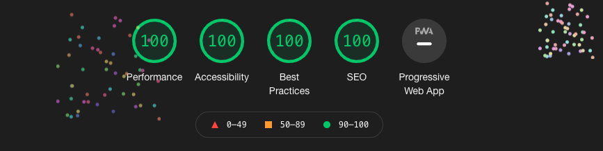

# Pet_the_cat 

This site was made as a school project to create a useless website. (In the theme of https://theuselessweb.com/). 
The web-app is made in native HTML, CSS and Javascript.

Personal focus for the app has been high quality and performance over functionality. 

* Images are exclusively SVG to maximize crispness and performance. 
* The app has been tested on Chrome (Desktop), Chrome (Mobile) Tesla built in browser, Brave, Safari (OSX), Safari (IOS). 
* The app is supported on screen-sizes from iPhone 5 (320 x 568)px to infinity and works in both portrait and landscape.  
 
#Site has been tested by classmates: 
* Martin Hansson
* Jonathan Larsson
